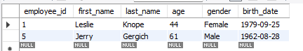

# Using WHERE clause

[Open WHERE sql](Where.sql)

## Where variable is a 'Some String'

> ```sql
> select *
> from employee_salary
> where first_name = 'Leslie';
> ```
>
> 

> ```sql
> select *
> from employee_demographics
> where gender != 'Male';  -- "Where gender IS NOT Male"
> ```
>
> All genders are NOT Male
> 

## Where variable is >= (_any operands_) integer

> ```sql
> select *
> from employee_salary
> where salary >= 50000;
> ```
>
> All salaries are >= $50,000
> 

## Logical Operators

Logical operators are AND, OR, OR NOT.

> #### AND
>
> ```sql
> select *
> from employee_demographics
> where birth_date > '1985-01-01'
> and gender = 'Male';  -- Person will be younger than 1985(> 1985) AND a male
> ```
>
> All employees are younger than 1985-01-01 AND a male
> 

> #### OR
>
> ```sql
> select *
> from employee_demographics
> where birth_date > '1985-01-01'
> OR gender = 'Male';  -- Person will be younger than 1985(> 1985) OR a male
> ```
>
> All employees are either younger than 1985-01-01 OR a male
> 

> #### OR NOT
>
> ```sql
> select *
> from employee_demographics
> where birth_date > '1985-01-01'
> OR NOT gender = 'Male';  -- Person will be younger than 1985(> 1985) OR NOT a male
> ```
>
> All employees are either younger than 1985-01-01 OR NOT a male
> 

> #### Multiple Operators
>
> ```sql
> select *
> from employee_demographics
> where (first_name = 'Leslie' AND age = 44) -- First name must be Leslie AND be age of 44
> or age > 55; -- OR greater than age 55
> ```
>
> All employees are either **named Leslie and age is 44**, OR they are **older than 55**.
> 
