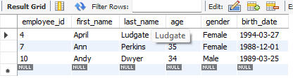
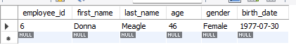
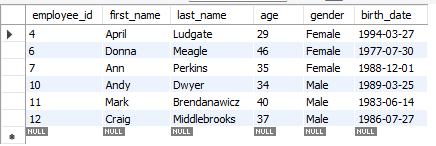
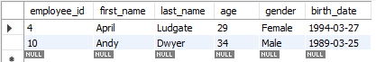

# Using WHERE LIKE statements

[Open WHERE sql](Where.sql)

> ## Where variable is like a% (Starts with A)
>
> ```sql
> select *
> from employee_demographics where first_name like 'a%';  -- Starts with A, but can end with any number of characters
> ```
>
> Starts with an A, but remaining characters don't matter
> 

> ## Where variable is like %a (Ends with A)
>
> ```sql
> select *
> from employee_demographics where first_name like '%a';  -- Ends with A, but can start with any number of characters
> ```
>
> Ends with an A, but remaining characters don't matter
> 

> ## Where variable is like %a% (There's an A somewhere)
>
> ```sql
> select *
> from employee_demographics where first_name like '%a%';  -- There is an A somewhere, but it doesn't matter where
> ```
>
> There is an A somewhere, but doesn't matter where.
> Note that even though there is %A%, it still includes names that START or END with A
> 

> ## Where variable is like a \_ \_ (Start with A with two characters following)
>
> ```sql
> select *
> from employee_demographics where first_name like 'a__';  -- Starts with A with only two characters following
> ```
>
> Starts with A with only two characters following
> .png>)

> ## Where variable is like a \_ \_ \_ (Start with A with three characters following)
>
> ```sql
> select *
> from employee_demographics where first_name like 'a___';  -- Starts with A with only three characters following
> ```
>
> Starts with A with only three characters following
> .png>)

> ## Where variable is like a \_ \_ \_ % (Start with A with at least three characters following)
>
> ```sql
> select *
> from employee_demographics where first_name like 'a___%';  -- Starts with A with at least three characters following
> ```
>
> Starts with A with at least three characters following.
> Note that there can be a+3 (Andy) or a+3+more (April)
> 
