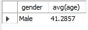
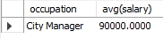

# Using group by & having

[Open having_vs_where sql](having_vs_where.sql)

> ## Group by xx having xx
>
> ```sql
> select gender, avg(age)  -- Creates columns for gender and average age
> from employee_demographics
> group by gender  --  Groups them by gender
> having avg(age) > 40; -- Only shows what has average age over 40
> ```
>
> Note that since Females average is is 39, it doesn't appear here.
>
> 

> ## Select xx where xx like xx and group by xx, having xx (aggregate function)

> ```sql
> select occupation, avg(salary) -- creates columns for occupation and >average salary
> from employee_salary
> where occupation like '%manager%' -- where the occupation has 'manager' somewhere in it
> group by occupation
> having avg(salary) > 75000; -- This only works after the group by runs
> ```
>
> 
