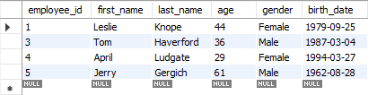
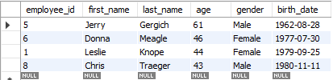
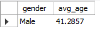

# Setting limits & aliasing

[Open limit\_&_aliasing sql](limit_&_aliasing.sql)

> ## Setting limit
>
> ```sql
> select *
> from employee_demographics
> limit 4;  -- Only show top 4 rows
> ```
>
> 

> ## Setting limit and order by age
>
> ```sql
> select *
> from employee_demographics
> order by age desc -- Orders from oldest to youngest
> limit 4;  -- Only show top 4 rows
> ```
>
> Note that they are sorted by oldest to youngest, and only showing top 4
> 

> ## Setting alias
>
> #### Before:
>
> ```sql
> select gender, avg(age)
> from employee_demographics
> group by gender
> having avg(age) > 40;
> ```
>
> .png>)
>
> #### After:
>
> ```sql
> select gender, avg(age) as avg_age -- Here is where the column name changes
> from employee_demographics
> group by gender
> having avg_age > 40;  -- You can call on the selected aggregate by the new >name
> ```
>
> 
>
> Note that you don't need "as" in the reassignement
>
> ```sql
> select gender, avg(age) avg_age -- No "as" statement
> group by gender
> having avg_age > 40;
> ```
