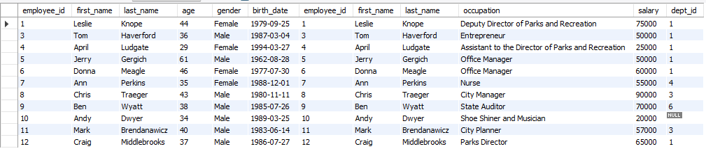
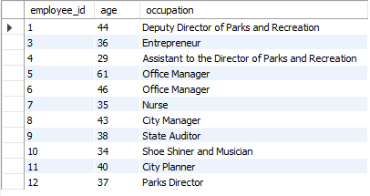
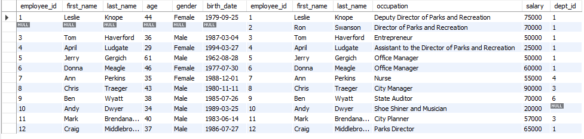
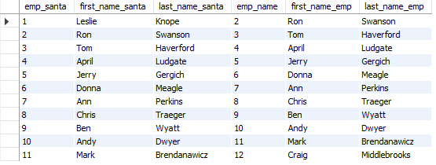
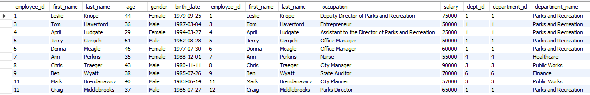

# Using joins

[Open joins sql](joins.sql)

> ## Inner-Joins (or just Joins)
>
> ```sql
> select *
> from employee_demographics as dem  -- Allias to make it easier later
> join employee_salary as sal
>   on dem.employee_id = sal.employee_id -- Join columns base on...
> ;
> ```
>
> 

> ## Inner-Joins with field list (age and occupation)
>
> ```sql
> select dem.employee_id, age, occupation -- They both share employee_id, but not age/occupation
> from employee_demographics as dem
> join employee_salary as sal
>   on dem.employee_id = sal.employee_id -- Join columns base on...
> ;
> ```
>
> 

> ## Left Outer-Join
>
> ```sql
> select *
> from employee_demographics as dem  -- This is the 'Left' table
> left outer join employee_salary as sal  -- This joins the 'Left' table to the 'Right' table
>   on dem.employee_id = sal.employee_id -- This doesn't affect left/right
> ;
> ```
>
> NOTE: This table is the same as the Inner-Joins above
> 

> ## Right Outer-Join
>
> ```sql
> select *
> from employee_demographics as dem  -- This is the 'Left' table
> right outer join employee_salary as sal  -- This joins the 'Left' table to the 'Right' table
>   on dem.employee_id = sal.employee_id -- This doesn't affect left/right
> ;
> ```
>
> Note that Ron Swanson now appears
> 

> ## Self-Join
>
> The table references itself, thus why it's a self-join:
>
> ```sql
> select emp1.employee_id as emp_santa,
> emp1.first_name as first_name_santa,
> emp1.last_name as last_name_santa,
> emp2.employee_id as emp_name,
> emp2.first_name as first_name_emp,
> emp2.last_name as last_name_emp
> from employee_salary as emp1
> join employee_salary as emp2
>   on emp1.employee_id + 1 = emp2.employee_id
> ;
> ```
>
> 

> ## Joining multiple tables
>
> ```sql
> select *
> from employee_demographics as dem
> join employee_salary as sal
>   on dem.employee_id = sal.employee_id
> join parks_departments as pd
>   on sal.dept_id = pd.department_id
> ;
> ```
>
> Note that the employee demographics table doesn't have anything to join to parks department, but joining it to employee salary table, then you can join.
> This demonstrates joining multiple tables
> 
