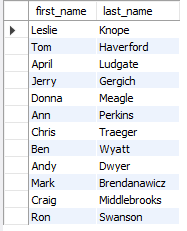
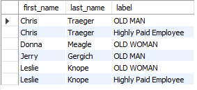

# Using unions

[Open unions sql](unions.sql)

> ## Union (distinct)
>
> ```sql
> select first_name, last_name
> from employee_demographics
> union -- distinct (only unique) is implied
> select first_name, last_name
> from employee_salary
> ;
> ```
>
> Note that it looks a lot like a typical "select first_name, last_name"...
> 

> ## Union ALL
>
> ```sql
> select first_name, last_name
> from employee_demographics
> union all
> select first_name, last_name
> from employee_salary
> ;
> ```
>
> This is both tables combined to one row
> 

> ## Multiple Unions
>
> ```sql
> select first_name, last_name, 'OLD MAN' as label
> from employee_demographics
> where age > 40 and gender = 'Male'  -- older than 40 and Male
> union
> select first_name, last_name, 'OLD WOMAN' as label
> from employee_demographics
> where age > 40 and gender = 'Female' -- older than 40 and Female
> union
> select first_name, last_name, 'Highly Paid Employee' as label
> from employee_salary
> where salary > 70000  -- Makes more than 70,000
> order by first_name, last_name;
> ```
>
> 
