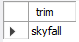
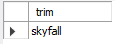
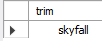
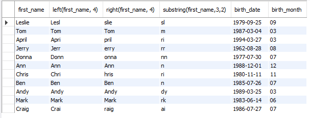

# String Functions

[Open string_functions sql](string_functions.sql)

> ## Length('string')
>
> ```sql
> select length('skyfall'); -- Has 7 letters
> ```
>
> .png>)

> ## Length(variable)
>
> ```sql
> select first_name, length(first_name) as name_length
> from employee_demographics
> order by name_length;
> ```
>
> Ordered from shortest name to longest
>
> .png>)

> ## Upper('string')
>
> ```sql
> select upper('skyfall'); -- You can use upper with string variables too
> ```
>
> .png>)

> ## Lower('string')
>
> ```sql
> select lower('SkYfAlL'); -- You can use lower with string variables too
> ```
>
> .png>)

> ## Trim (' string ')
>
> ```sql
> select trim('         skyfall            ') as trim;
> ```
>
> 
>
> ```sql
> select Ltrim('         skyfall            ') as ltrim;
> ```
>
> 
>
> ```sql
> select Rtrim('         skyfall            ') as rtrim;
> ```
>
> 

> ## Left, Right, and Substring
>
> ```sql
> select first_name,
> left(first_name, 4), -- Shows the left 4 characters
> right(first_name, 4),  -- Shows the right 4 characters
> substring(first_name,3,2), -- Shows the character starting in position 3, and a total of 2 characters to the right
> birth_date,
> substring(birth_date, 6,2) as birth_month -- 1 9 7 9 - 0 9 - 2 5
>                                              1 2 3 4 5 6 7 8 9 10
>      -- Start at 6, and include total of 2 characters (09)
> from employee_demographics;
> ```
>
> 

> ## Replace(variable, 'a', 'z')
>
> ```sql
> select first_name, replace(first_name, 'a', 'z') -- In first_name, replace 'a' with 'z'
> from employee_demographics;
> ```
>
> .png>)

> ## locate('a', variable)
>
> ```sql
> select locate('a', 'Landon'); -- Locate the first 'a' in 'Landon'
> ```
>
> The 'a' is the 2nd character in Landon
> .png>)
>
> ---
>
> ```sql
> select first_name, locate('An', first_name) -- Locate the first 'An' in first_name.
> from employee_demographics;
> ```
>
> Note that it is case sensitive. Donna doesn't have 'An'.
> .png>)

> ## Concat(variable1, variable2, variable3...) (Concatenate)
>
> ```sql
> select first_name, last_name,
> concat(first_name, ' ', last_name) as full_name
> from employee_demographics;
> ```
>
> .png>)
