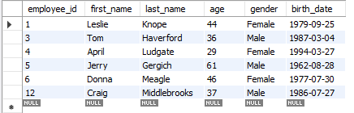

# Subqueries

[Open subquery sql](subqueries.sql)

> ## Where XX in (subquery)
>
> ```sql
> select *
> from employee_demographics
> where employee_id IN ( -- Where employee ID in demographic table is IN salary table
>   select employee_id
>   from employee_salary
>   where dept_id = 1 -- Where dept is 1
> )
>
> ```
>
> This is the `employee_demographics` table, only showing employees who have a `dept_id = 1` from `employee_salary` table
> 